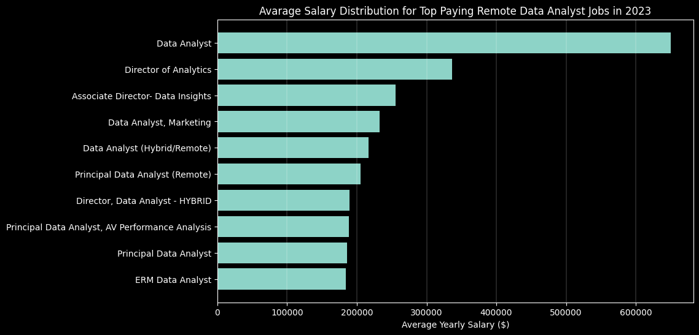

# Introduction
This project focused on identifying the most in-demand 🔥, well-compensated 💵 skills for remote 🌎 data analytics jobs. By analyzing 🔍 the data analytics job market, I aimed to determine the optimal skillset that combines these desirable qualities 📊.

SQL queries: [queries](/sql_queries/)  <br />
Python scripts: [scripts](/python_scripts/)

# Data I Used

Data comes from: **Luke Barousse**  <br />
Creators of tools such as e.g. https://datanerd.tech/

# Tools I Used

For my comprehensive exploration of the data analyst job market, I utilized several essential tools:

- **SQL**: The cornerstone of my analysis, enabling me to query the database and extract vital insights.

- **PostgreSQL**: The database management system I selected, perfect for managing the job posting data.

- **Visual Studio Code**: My preferred environment for managing the database and executing SQL queries.

- **Git & GitHub**: Crucial for version control and sharing my SQL scripts and findings, facilitating collaboration and project tracking.

- **Python (Matplotlib)**: Crucial for creating charts to improve data storytelling.

# The Analysis

I designed a series of questions to delve into different corners of the data analyst job market. Here's what I investigated:

### 1. Top Paying Data Analyst Remote Jobs

To find the best paying data scientist jobs, I had to filter data by location and average yearly salary. This query shows the 10 most lucrative roles.

```SQL
SELECT
    job_id,
    job_title,
    name AS company_name,
    job_location,
    job_schedule_type,
    salary_year_avg,
    job_posted_date
FROM    
    job_postings_fact
LEFT JOIN
    company_dim
ON
    job_postings_fact.company_id = company_dim.company_id
WHERE 
    job_title_short = 'Data Analyst'
    AND salary_year_avg IS NOT NULL
    AND job_work_from_home = TRUE
ORDER BY    
    salary_year_avg DESC
LIMIT 10
```
Here are the conclusions I was able to notice:
- Companies that offer high pay for data analyst are from a **variety of industries** (Meta, SmartAsset, Get It Recruit), indicating a wide range of employment opportunities in high-paying jobs.
- The **wide range of salaries**, from $184,000 to $650,000, shows significant salary potential for this position.
- The **difference in specific job titles** shows that you don't necessarily need to be a director to earn a salary in the upper ranges.


*Bar graph visualizing the salary for the top 10 salaries for data analysts* | code: [top_paying_jobs](/python_scripts/top_paying_jobs.ipynb)

### 2. Highest Paying Jobs Skills Needed

To find out what employers are most looking for in the highest-paid roles, I decided to join the data from the previous query with the skills data.

```SQL
WITH top_paying_jobs AS (
    SELECT
        job_id,
        job_title,
        name AS company_name,
        job_location,
        job_schedule_type,
        salary_year_avg, 
        job_posted_date
    FROM    
        job_postings_fact
    LEFT JOIN
        company_dim
    ON
        job_postings_fact.company_id = company_dim.company_id
    WHERE 
        job_title_short = 'Data Analyst'
        AND salary_year_avg IS NOT NULL
        AND job_work_from_home = TRUE
    ORDER BY    
        salary_year_avg DESC
    LIMIT 10
)

SELECT 
    skills,
    COUNT(*) AS number_of_occurrences
FROM top_paying_jobs
INNER JOIN skills_job_dim ON top_paying_jobs.job_id = skills_job_dim.job_id
INNER JOIN skills_dim ON skills_job_dim.skill_id = skills_dim.skill_id
WHERE skills IS NOT NULL
GROUP BY skills
ORDER BY number_of_occurrences DESC
```

Here are the conclusions I was able to notice:
- The most desired skills in the best paid job offers are **SQL**, **python**, **tableau** and **R**.
- For data visualization in these job offers **tableau is more common than powerbi**.
- Skills such as snowflake, pandas or excel were present in 3 out of 10 offers.


*Bar graph visualizing the count of skills for the top paying jobs for data analysts* | code: [top_paying_jobs_skills_required](/python_scripts/top_paying_jobs_skills_required.ipynb)

### 3. Most Desirable Skills for Data Analysts

This query helped me identify the skills that appeared most frequently in remote job postings for data analysts.

```SQL
WITH skill_remote_job_count AS (
    SELECT 
        skill_id,
        COUNT(skills_job_dim.job_id) as job_count
    FROM
        skills_job_dim
    LEFT JOIN
        job_postings_fact
    ON
        skills_job_dim.job_id = job_postings_fact.job_id
    WHERE
        job_postings_fact.job_work_from_home = TRUE
        AND job_postings_fact.job_title_short = 'Data Analyst'
    GROUP BY
        skill_id
)

SELECT 
    skills,
    job_count
FROM 
    skills_dim
LEFT JOIN skill_remote_job_count
    ON skills_dim.skill_id = skill_remote_job_count.skill_id
WHERE
    job_count IS NOT NULL
ORDER BY
    job_count DESC
LIMIT 5
```
Here are the conclusions I was able to notice:
- **SQL** is the most desired skill, along with **Excel**, which is second on the list, 
emphasizing the need for strong data processing and spreadsheet skills.
- **Programming and Visualization Tools** like **Python**, **Tableau**, and **Power BI** are essential, pointing towards the increasing importance of technical skills in data storytelling and decision support.

| Skill | Job Count |
|---|---|
| sql | 7291 |
| excel | 4611 |
| python | 4330 |
| tableau | 3745 |
| power bi | 2609 |

*The table shows the 5 most desired skills on the data analyst job postings*

### 4. Highest Paid Skills for Data Analysts

This time leveraging market data, I identified the most highly compensated skills for data analysts.

```SQL
WITH skill_remote_job_count AS (
    SELECT 
        skill_id,
        COUNT(skills_job_dim.job_id) as job_count,
        ROUND(AVG(salary_year_avg)) as avg_year_salary
    FROM
        skills_job_dim
    LEFT JOIN
        job_postings_fact
    ON
        skills_job_dim.job_id = job_postings_fact.job_id
    WHERE
        job_postings_fact.job_work_from_home = TRUE
        AND job_postings_fact.job_title_short = 'Data Analyst'
        AND salary_year_avg IS NOT NULL
    GROUP BY
        skill_id
)

SELECT 
    skills,
    avg_year_salary
FROM 
    skills_dim
LEFT JOIN skill_remote_job_count
    ON skills_dim.skill_id = skill_remote_job_count.skill_id
WHERE
    job_count IS NOT NULL
ORDER BY
    avg_year_salary DESC
LIMIT 20
```
Here are the conclusions I was able to notice:
- Top salaries are commanded by analysts skilled in **big data technologies** (PySpark, Couchbase), **machine learning tools** (DataRobot, Jupyter), and **Python libraries** (Pandas, NumPy), reflecting the industry's high valuation of data processing and predictive modeling capabilities.
- Knowledge in **development and deployment tools** (GitLab, Kubernetes, Airflow) 
indicates a lucrative crossover between data analysis and engineering, 
with a premium on skills that facilitate automation and efficient data pipeline management.
- Familiarity with **cloud and data engineering tools** (Elasticsearch, Databricks, GCP) underscores the growing importance of cloud-based analytics environments, 
suggesting that cloud proficiency significantly boosts earning potential in data analytics.

| Skill | Average Yearly Salary ($) |
|---|---|
| pyspark | 208172 |
| bitbucket | 189155 |
| couchbase | 160515 |
| watson | 160515 |
| datarobot | 155486 |
| gitlab | 154500 |
| swift | 153750 |
| jupyter | 152777 |
| pandas | 151821 |
| golang | 145000 |
| elasticsearch | 145000 |

*The table shows avarage salary for the 10 the paying skills for remote data analyst*

### 5. Most Optimal Skills for Data Analysts

By combining data on the most in-demand skills and the highest-paid skills, I created a query that identifies both well-paid and high-demand skills.

```SQL
WITH skill_remote_job_count AS (
    SELECT 
        skill_id,
        COUNT(skills_job_dim.job_id) as job_count
    FROM
        skills_job_dim
    LEFT JOIN
        job_postings_fact
    ON
        skills_job_dim.job_id = job_postings_fact.job_id
    WHERE
        job_postings_fact.job_work_from_home = TRUE
        AND job_postings_fact.job_title_short = 'Data Analyst'
    GROUP BY
        skill_id
)

SELECT 
    skills,
    job_count
FROM 
    skills_dim
LEFT JOIN skill_remote_job_count
    ON skills_dim.skill_id = skill_remote_job_count.skill_id
WHERE
    job_count IS NOT NULL
ORDER BY
    job_count DESC
LIMIT 5
```

Here are the conclusions I was able to notice:
- **Programming and Scripting Languages like Python and R** are crucial, reflecting their importance in data analysis tasks.
- Expertise in **Snowflake, Azure, AWS** is in high demand, underscoring the need for **cloud and big data skills**.
- Proficiency in tools like **Tableau and Looker** highlights the significance of effective **data visualization and integration** in the data analyst role.

| Skill | Job Count | Average Yearly Salary ($) |
|---|---|---|
| go | 27 | 115320 |
| confluence | 11 | 114210 |
| hadoop | 22 | 113193 |
| snowflake | 37 | 112948 |
| azure | 34 | 111225 |
| bigquery | 13 | 109654 |
| aws | 32 | 108317 |
| java | 17 | 106906 |
| ssis | 12 | 106683 |
| jira | 20 | 104918 |
| oracle | 37 | 104534 |
| looker | 49 | 103795 |
| nosql | 13 | 101414 |
| python | 236 | 101397 |
| r | 148 | 100499 |
| redshift | 16 | 99936 |
| qlik | 13 | 99631 |
| tableau | 230 | 99288 |
| ssrs | 14 | 99171 |
| spark | 13 | 99077 |

*The table shows most optimal skills for data analyst sorted by salary (20)*

# What I Learned

While working on this project, I honed my skills:

- 🏗️ **Complex Queries**: I tackled advanced SQL, becoming much better at joining tables and wielding WITH clauses to manipulate temporary data with precision.
- 📚 **Data Aggregation**: I befriended GROUP BY and turned aggregate functions like COUNT() and AVG() into my go-to tools for data summarization.
- 🎯 **Problem Solveing**: I honed my real-world problem-solving skills by translating questions into insightful and actionable SQL queries.
- 📊 **Data Visualization Masterclass**: I leveraged Python's Matplotlib library to transform raw data into clear and compelling visualizations. This newfound skill allows me to communicate insights effectively to  audiences.

# Conclusions

Key Takeaways from Data Analyst Jobs Analysis:

- **Lucrative Field, Competitive Landscape**: Data analyst salaries can be very high, with some reaching $650,000! However, these top salaries are rare.
- **Advanced Skills for High Pay**: Strong salaries are associated with advanced skills in SQL, Python, R, and data visualization tools. Investing in these skills can significantly improve your earning potential.
- **In-Demand Skills**: SQL, visualization tools (Tableau, Power BI), and Python are the most sought-after skills by employers. Excel remains highly relevant, ranking as the second most desired skill.
- **Specialist Skills and Higher Earnings**: Less common but specialized skills often command higher salaries, indicating a premium for niche expertise.
- **Mastering Core Skills for Market Value**: SQL's high demand and strong average salary make it an excellent skill for data analysts seeking to maximize their marketability. The same applies to Python, R, and Tableau.